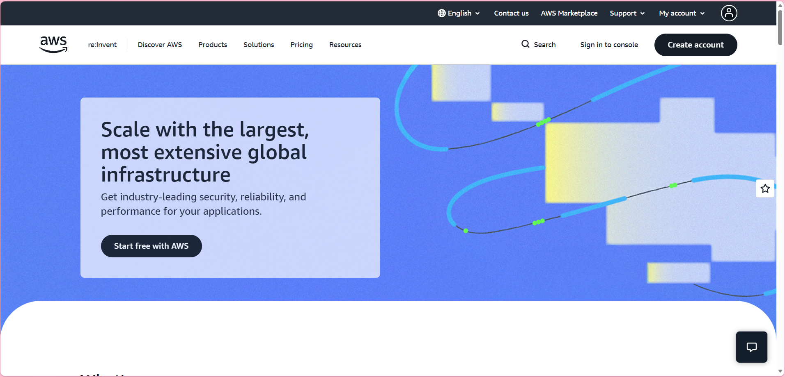

# Amazon Web Services (AWS)

## Brief Overview

Amazon Web Services (AWS) is a cloud platform that provides online services for organizations and developers. It offers resources for running applications, storing information, managing networks, controlling access, and supporting different types of workloads without requiring companies to maintain all the physical infrastructure themselves.

## Global Infrastructure

AWS operates through a worldwide infrastructure made up of **Regions and Availability Zones**. Regions represent different geographic areas, while Availability Zones are separate locations within those Regions.

This arrangement gives organizations more choices when deciding where their applications and data should be hosted. Using more than one Availability Zone can also help applications remain available when an issue affects a particular location.

## Cloud Management Console

The AWS Management Console is a browser-based tool for working with AWS services. Users can use the console to create resources, adjust configurations, check resource activity, and manage access permissions through a graphical interface.

## Four Core Services

### 1. Amazon EC2

Amazon Elastic Compute Cloud (EC2) provides virtual computing instances that can run operating systems, applications, and other workloads. Users can select different instance configurations depending on the processing and memory requirements of their applications.

### 2. Amazon S3

Amazon Simple Storage Service (S3) is designed for storing objects such as documents, images, videos, backups, and application files. It provides a way to keep large amounts of data in cloud storage and access the stored objects when needed.

### 3. Amazon VPC

Amazon Virtual Private Cloud (VPC) allows users to create an isolated virtual network for AWS resources. Network settings such as subnets, IP addressing, routes, and connectivity can be configured according to the needs of the environment.

### 4. AWS IAM

AWS Identity and Access Management (IAM) is used to manage access to AWS resources. It allows permissions to be assigned to users, groups, and roles so that access can be controlled according to specific responsibilities.

## Three Advantages

### 1. Flexible Service Options

AWS provides a large selection of cloud services that can be combined to create different types of applications and infrastructure. This gives organizations flexibility when planning their cloud environments.

### 2. Resource Scalability

Cloud resources can be adjusted when workload requirements change. An organization can increase resources when demand becomes higher or reduce them when fewer resources are needed.

### 3. Worldwide Availability

The AWS global infrastructure provides locations in different parts of the world. This allows organizations to select locations that are appropriate for their applications, users, and operational requirements.

## Typical Enterprise Use Cases

Organizations can use AWS for many business and technical purposes. Companies may use EC2 to host applications, S3 to store business files and backups, and VPC to organize their network environment.

AWS can also support website hosting, application development, data storage, backup operations, system migration, and disaster recovery. The services can be combined depending on the requirements of a particular organization.

## Screenshot

